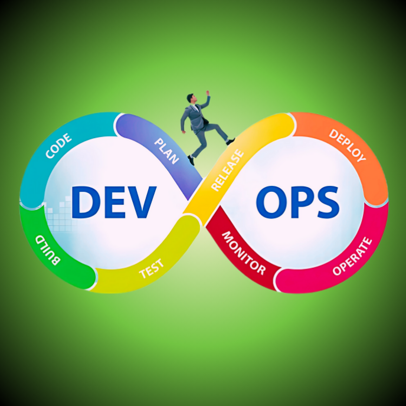

<div align="center">
<br>



</div>


<p align="center">


</p>


<h1 align="center"> Introduction to DevOps: Automate Everything to Focus on What Really Matters </h1>


<h3 align="center">
<a href="https://github.com/RazikaBengana/holbertonschool-validation/tree/main/module1#eye-about">About</a> •
<a href="https://github.com/RazikaBengana/holbertonschool-validation/tree/main/module1#hammer_and_wrench-tasks">Tasks</a> •
<a href="https://github.com/RazikaBengana/holbertonschool-validation/tree/main/module1#memo-learning-objectives">Learning Objectives</a> •
<a href="https://github.com/RazikaBengana/holbertonschool-validation/tree/main/module1#computer-prerequisites">Prerequisites</a> •
<a href="https://github.com/RazikaBengana/holbertonschool-validation/tree/main/module1#mag_right-resources">Resources</a> •
<a href="https://github.com/RazikaBengana/holbertonschool-validation/tree/main/module1#bust_in_silhouette-authors">Authors</a> •
<a href="https://github.com/RazikaBengana/holbertonschool-validation/tree/main/module1#octocat-license">License</a>
</h3>

---

<!-- ------------------------------------------------------------------------------------------------- -->

<br>
<br>

## :eye: About

<br>

<div align="center">

**`Introduction to DevOps: automate everything to focus on what really matters`** project introduces the fundamental concepts of configuration management and automation using `Hugo`, a static site generator.
<br>
The folder contains initial configurations for content structure, theming, and asset management, which are the basis for creating and managing websites in a `DevOps` environment.
<br>
<br>
This project has been created by **[Holberton School](https://www.holbertonschool.com/about-holberton)** to enable every student to understand how automation works in the deployment and configuration of websites.

</div>

<br>
<br>

<!-- ------------------------------------------------------------------------------------------------- -->

## :hammer_and_wrench: Tasks

<br>

**`0. Go-Hugo Website`**

**`1. Development Lifecycle with Makefile`**

**`2. Empathy as Code: Inline Help, Comment and Documentation`**

**`3. From Development to Production`**

**`4. Fixing the Production Deployment`**

<br>
<br>

<!-- ------------------------------------------------------------------------------------------------- -->

## :memo: Learning objectives

<br>

This project aims at showing use cases where a `DevOps` mindset is bringing value to a software project by automating it, which decreases the amount of manual work and increases the development speed. 
<br>
<br>
It focuses on why automation is useful and helps speeding a development lifecycle.

<br>

**_After this project, you should be able to:_**

<br>

```diff

+ Understand the value of automating tedious tasks

+ Define a development lifecycle

+ Automate shell-like tasks with Make, and/or shell script

+ Be aware of tools dependencies and the value of reproducing environment

+ Build static HTML website from Markdown code using Go-Hugo

```

<br>
<br>

<!-- ------------------------------------------------------------------------------------------------- -->

## :computer: Prerequisites

<br>

### Concepts

<br>

**You should have a basic knowledge of the following concepts**:

<br>

- `Shell` terminal basics, using command lines:

    - Navigating in a `Unix` file-system 
    - Understanding how `stdin`/`stdout` redirection and piping 
    - Showing and searching the content of a text files 
    - Defining and using Environment Variables 
    - Adding command lines to your terminal using the `apt-get` package manager and/or with the `PATH` variable 
    - Writing and executing a shell script

<br>

- `Git` with the command line (and also a graphical interface)

    - Retrieving or creating a repository  
    - Manipulating changes locally with Git’s 3 steps process (workspace, staging, history)
    - Distributing changes history with remotes repositories

<br>

- `Make`/`Makefile` usage:

    - Executing tasks through make targets
    - Default target and `PHONY` target 
    - Makefile’s variables and macro syntax

<br>
<br>

### Tooling

<br>

This project needs the following tools / services:

<br>

- An HTML5-compliant web browser (`Firefox`, `Chrome`, `Opera`, `Safari`, `Edge`, etc.)


- A free account on [GitHub](https://github.com/), referenced as `<GitHub Handle>`


- A shell terminal with `bash`, `zsh` or `ksh`, including the standard `Unix` toolset (`ls`, `cd`, etc.) with:
  
    - `GNU Make` in version `3.81+`
    - `Git` (command line) in version `2+`
    - [Go Hugo](https://gohugo.io/) **v0.84.0** (**:warning: very crucial for the theme that you’ll use**).


- The student needs to be able to spawn up a clean `Ubuntu 18.04` system. <br>
Therefore `Docker` is recommended with NO prior knowledge.


- A text editor or IDE (_Integrated Development Editor_) of your convenience (`Visual Code`, `Notepad++`, `Vim`, `Emacs`, `IntelliJ`, etc.)

<br>
<br>

### Story

<br>

Congratulations!

It’s your first day at “**Awesome Inc.**” as a software engineer. <br>
This company is currently experiencing fast growth and hired you to work on their web services. <br>

Your predecessor left to travel the world, and the expectations are high on your ability to help "Awesome Inc.” to grow a culture of collaboration with a technical mindset, while managing their existing web services. <br>

That’s exactly what `DevOps` is about!

<br>
<br>

<!-- ------------------------------------------------------------------------------------------------- -->

## :mag_right: Resources

<br>

**_Do you need some help?_**

<br>

**Read or watch:**

* [Go Hugo Quickstart](https://gohugo.io/getting-started/quick-start/)

* [Git SCM Book](https://git-scm.com/book/en/v2)

* [GNU Make Docs](https://www.gnu.org/software/make/manual/html_node/index.html)

* [Installing & Using Themes](https://www.youtube.com/watch?v=L34JL_3Jkyc&ab_channel=MikeDane)

* [Add a help target to a Makefile](https://gist.github.com/prwhite/8168133)

<br>
<br>

<!-- ------------------------------------------------------------------------------------------------- -->

## :bust_in_silhouette: Authors

<br>

**${\color{blue}Razika \space Bengana}$**

<br>
<br>

<!-- ------------------------------------------------------------------------------------------------- -->

## :octocat: License

<br>

```Introduction to DevOps: automate everything to focus on what really matters``` _project has no license specified._

<br>
<br>

---

<p align="center"><br>2023</p>