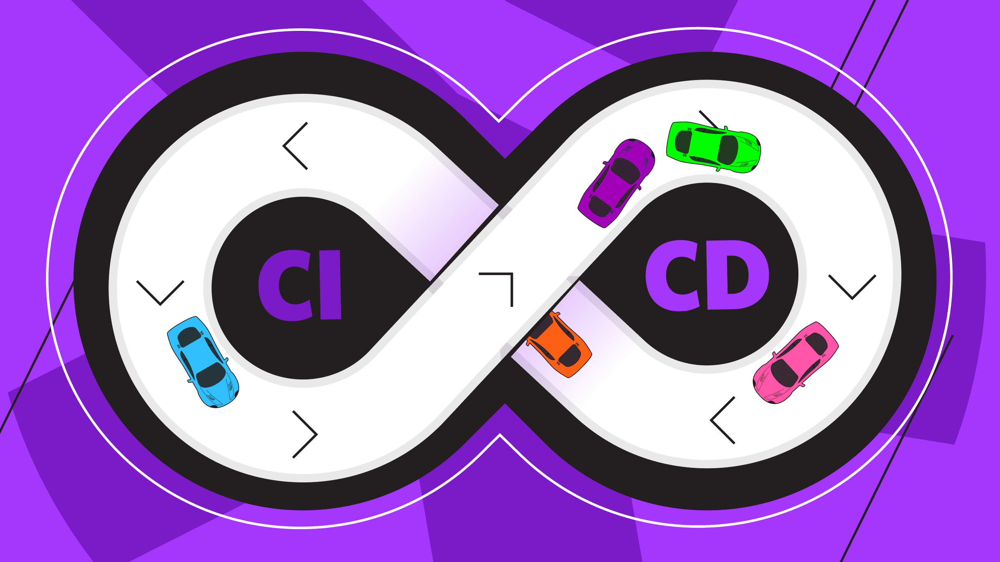

<div align="center">
<br>



</div>


<p align="center">


</p>


<h1 align="center"> Continuous Integration / Continuous Deployment </h1>


<h3 align="center">
<a href="https://github.com/RazikaBengana/holbertonschool-validation/tree/main/module3#eye-about">About</a> •
<a href="https://github.com/RazikaBengana/holbertonschool-validation/tree/main/module3#hammer_and_wrench-tasks">Tasks</a> •
<a href="https://github.com/RazikaBengana/holbertonschool-validation/tree/main/module3#memo-learning-objectives">Learning Objectives</a> •
<a href="https://github.com/RazikaBengana/holbertonschool-validation/tree/main/module3#computer-prerequisites">Prerequisites</a> •
<a href="https://github.com/RazikaBengana/holbertonschool-validation/tree/main/module3#mag_right-resources">Resources</a> •
<a href="https://github.com/RazikaBengana/holbertonschool-validation/tree/main/module3#bust_in_silhouette-authors">Authors</a> •
<a href="https://github.com/RazikaBengana/holbertonschool-validation/tree/main/module3#octocat-license">License</a>
</h3>

---

<!-- ------------------------------------------------------------------------------------------------- -->

<br>
<br>

## :eye: About

<br>

<div align="center">

**`Continuous Integration / Continuous Deployment`** module explores automated pipelines that streamline both code integration and deployment.
<br>
The `Hugo`-generated website is built and tested continuously, with updates automatically deployed as soon as changes are made to the content or configuration.
<br>
The project leverages **GitHub Actions** to automate these processes, ensuring efficient development and delivery.
<br>
<br>
This project has been created by **[Holberton School](https://www.holbertonschool.com/about-holberton)** to enable every student to understand how **DevOps workflows**, **testing practices**, **CI/CD**, and **containerization** work.

</div>

<br>
<br>

<!-- ------------------------------------------------------------------------------------------------- -->

## :hammer_and_wrench: Tasks

<br>

**`0. Continuous Integration with GitHub Actions`**

**`1. Add Build Dependencies to the CI Environment`**

**`2. Earlier Feedback with Continuous Delivery`**

**`3. Automate Releases with Git Tags and GitHub Releases`**

**`4. Safer Collaboration with Pull Requests`**

**`5. Continuous Deployment of the Static Website to Netlify`**

<br>
<br>

<!-- ------------------------------------------------------------------------------------------------- -->

## :memo: Learning objectives

<br>

This project aims at practicing with Continuous Integration (`CI`) / Delivery (`CD`) / Deployment to understand the differences, the goals and the value.<br>
<br>
The goal is to understand the pros and cons of different testing methods to be able to understand the value of doing, or not doing, a kind of test.

<br>

**_After this project, you should be able to:_**

<br>

```diff

+ Implement Continuous Integration workflows using GitHub Actions

+ Tell if a given GitHub Action’s workflow is about Continuous Integration (CI), or Continuous Delivery (CD) or Continuous Deployment (skill of context analysis)

+ Understand the challenges of build reproductibility, through management of build dependencies using APT packages, NPM, Python3’s pip, and direct binary downloads.

+ Build collaboratively a Software Delivery Pipeline and produce released artifacts, including documenting the changes and the usage

+ Continuously deploy a static web site to Netlify

```

<br>

-  [Netlify](https://www.netlify.com/)
<br>
<br>

<!-- ------------------------------------------------------------------------------------------------- -->

## :computer: Prerequisites

<br>

### Concepts

<br>

**You should have a basic knowledge of the following concepts:**

<br>

- What is and how to use **git tags**

- Basics of what is and how to use a **GitHub “Release”**

- What is and how to create/use a `ZIP` archive

- Know how to write a valid `YAML` file

<br>
<br>

### Tooling

<br>

This project needs the following tools / services:

<br>

- The command lines:

  - [yq](https://mikefarah.gitbook.io/yq/) `v4.5.0`
  
  - [shellcheck](https://github.com/koalaman/shellcheck) `v0.x`
  
  - [yamllint](https://github.com/adrienverge/yamllint) `v1.x`
  
  - [jq](https://jqlang.github.io/jq/) `v1.x`

<br>
<br>

### Story

<br>

Continuing your journey as a Software Engineer at **Awesome Inc.**, you want to provide early visibility on your work to your colleagues to allow you to iterate on the most important issues or improvements for the company.

By defining a Software Delivery Pipeline with automated tasks, you’ll ensure that the collaboration between teams is improved, and that your team grows in maturity while providing an efficient process to ensure that you can deliver the application often.

<br>
<br>

<!-- ------------------------------------------------------------------------------------------------- -->

## :mag_right: Resources

<br>

**_Do you need some help?_**

<br>

**Read or watch:**

+ [Github - Actions](https://docs.github.com/en/actions)

+ [Github - Managing Releases in a Repository](https://docs.github.com/en/github/administering-a-repository/managing-releases-in-a-repository)

+ [Git - Tagging](https://git-scm.com/book/en/v2/Git-Basics-Tagging)

+ [Continuous Integration](http://martinfowler.com/articles/continuousIntegration.html)

+ [Continuous Delivery](http://martinfowler.com/bliki/ContinuousDelivery.html)

+ [Continuous Integration, Delivery, Deployment and Maturity Model](http://blog.arungupta.me/continuous-integration-delivery-deployment-maturity-model)

+ [Github - Action gh-release](https://github.com/softprops/action-gh-release)

+ [Github - Netlify Actions](https://github.com/marketplace/actions/netlify-actions)

+ [Netlify CLI - Obtain a Token with the Command Line](https://docs.netlify.com/cli/get-started/#obtain-a-token-via-the-command-line)

+ [Get started with Netlify CLI](https://docs.netlify.com/cli/get-started/)

+ [Netlify](https://www.netlify.com/)

+ [Github - Release Drafter](https://github.com/release-drafter/release-drafter)

+ [Github - About Pull Requests](https://docs.github.com/en/github/collaborating-with-issues-and-pull-requests/about-pull-requests)

+ [Github - Action create-release](https://github.com/actions/create-release)

+ [yq](https://mikefarah.gitbook.io/yq/)

+ [Heroku](https://www.heroku.com/)

+ [ShellCheck](https://github.com/koalaman/shellcheck)

+ [Github Actions - About Github-hosted Runners - Supported Software](https://docs.github.com/en/actions/reference/specifications-for-github-hosted-runners#supported-software)

+ [Github Actions - About GitHub-hosted Runners](https://docs.github.com/en/actions/reference/specifications-for-github-hosted-runners)

+ [Github Actions - Events that Trigger Workflows](https://docs.github.com/en/actions/reference/events-that-trigger-workflows)

+ [GitHub Actions - Documentation](https://docs.github.com/en/actions/reference#workflow-syntax)

+ [GitHub Actions - Documentation (2)](https://docs.github.com/en/free-pro-team@latest/actions/reference)

+ [Quickstart for GitHub Actions](https://docs.github.com/en/actions/quickstart)

<br>
<br>

<!-- ------------------------------------------------------------------------------------------------- -->

## :bust_in_silhouette: Authors

<br>

**${\color{blue}Razika \space Bengana}$**

<br>
<br>

<!-- ------------------------------------------------------------------------------------------------- -->

## :octocat: License

<br>

```Continuous Integration / Continuous Deployment``` _project has no license specified._

<br>
<br>

---

<p align="center"><br>2023</p>