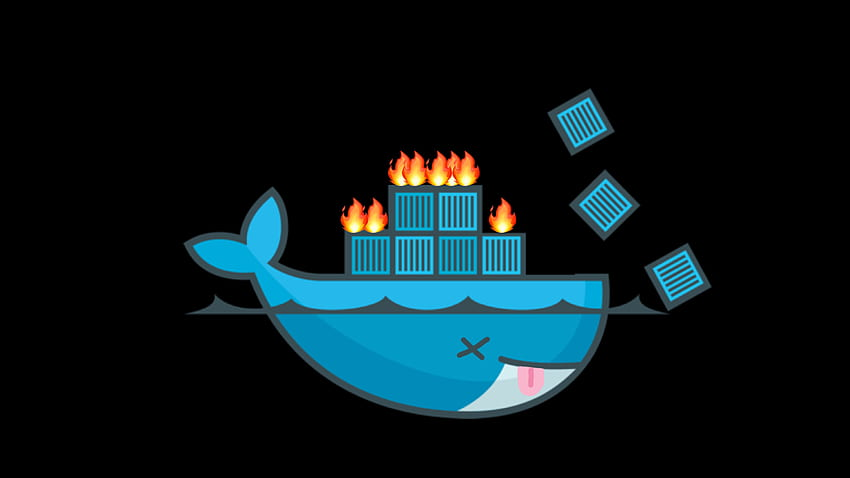

<div align="center">
<br>



</div>

<p align="center">


</p>


<h1 align="center"> Creating Applications in Containers with Docker </h1>


<h3 align="center">
<a href="https://github.com/RazikaBengana/holbertonschool-validation/tree/main/module4#eye-about">About</a> •
<a href="https://github.com/RazikaBengana/holbertonschool-validation/tree/main/module4#hammer_and_wrench-tasks">Tasks</a> •
<a href="https://github.com/RazikaBengana/holbertonschool-validation/tree/main/module4#memo-learning-objectives">Learning Objectives</a> •
<a href="https://github.com/RazikaBengana/holbertonschool-validation/tree/main/module4#computer-prerequisites">Prerequisites</a> •
<a href="https://github.com/RazikaBengana/holbertonschool-validation/tree/main/module4#mag_right-resources">Resources</a> •
<a href="https://github.com/RazikaBengana/holbertonschool-validation/tree/main/module4#bust_in_silhouette-authors">Authors</a> •
<a href="https://github.com/RazikaBengana/holbertonschool-validation/tree/main/module4#octocat-license">License</a>
</h3>

---

<!-- ------------------------------------------------------------------------------------------------- -->

<br>
<br>

## :eye: About

<br>

<div align="center">

**`Creating applications in containers with Docker`** module focuses on containerization using `Docker`.
<br>
Applications built with `Hugo` are containerized, allowing for consistent environments across development, testing, and production.
<br>
`Dockerfile` and `Docker Compose` configurations are key elements of this phase, ensuring that applications run reliably when deployed on different platforms.
<br>
<br>
This project has been created by **[Holberton School](https://www.holbertonschool.com/about-holberton)** to enable every student to understand how **DevOps workflows**, **testing practices**, **CI/CD**, and **containerization** work.

</div>

<br>
<br>

<!-- ------------------------------------------------------------------------------------------------- -->

## :hammer_and_wrench: Tasks

<br>

**`0. Building Inside a Docker Container`**

**`1. Building With A Custom Docker Image`**

**`2. Testing Docker Images`**

**`3. Packaging the Application as a Docker Image`**

**`4. A Lean Deployment Pipeline with Multi-Stage Docker Image and Heroku`**

<br>
<br>

<!-- ------------------------------------------------------------------------------------------------- -->

## :memo: Learning Objectives

<br>

This project aims at understanding the benefits of `Docker` by going over problems it solves.

<br>

**_After this project, you should be able to:_**

<br>

```diff

+ Learn to create, deploy, and run applications via Docker containers.

+ Build and test software as part of a CI/CD pipeline, using Docker.

```

<br>
<br>

<!-- ------------------------------------------------------------------------------------------------- -->

## :computer: Prerequisites

<br>

### Concepts

<br>

**You should have a basic knowledge of the following concepts:**

<br>

- Understand the basics of a [Docker Container](https://docs.docker.com/get-started/)

<br>
<br>

### Tooling

<br>

This project needs the following tools / services:

<br>

- [Docker](https://www.docker.com/get-started/) should be installed on your machine.

  - If you cannot use `Docker`, then you can use the website https://labs.play-with-docker.com/.

<br>
<br>

### Story

<br>

Now that your teams are using `CI/CD`, you would like to solve the “reproducibility” challenge for both the build environment and the production environment.

While it’s not the only way of doing it, `Docker` would be a great tool for solving these challenges.

<br>
<br>

<!-- ------------------------------------------------------------------------------------------------- -->

## :mag_right: Resources

<br>

**_Do you need some help?_**

<br>

**Read or watch:**

+ [Docker 101 Tutorial](https://www.docker.com/101-tutorial)

+ [Docker Docs - Get Started](https://docs.docker.com/get-started/)

+ [Docker Tutorial for Beginners](https://docker-curriculum.com/)

+ [Heroku Dev Center - Building Docker Images with heroku.yml](https://devcenter.heroku.com/articles/build-docker-images-heroku-yml)

+ [Docker Docs - Multi-stage](https://docs.docker.com/develop/develop-images/multistage-build/)

+ [Docker - Deploy to Heroku](https://github.com/marketplace/actions/deploy-to-heroku#deploy-with-docker)

+ [Heroku Dev Center - Container Registry and Runtime](https://devcenter.heroku.com/articles/container-registry-and-runtime#one-off-dynos)

+ [Heroku Dev Center - Deploying with Docker](https://devcenter.heroku.com/categories/deploying-with-docker)

+ [Heroku](https://www.heroku.com)

+ [Github - Container Structure Tests](https://github.com/GoogleContainerTools/container-structure-test)

+ [Github - Haskell Dockerfile Linter](https://github.com/hadolint/hadolint)

+ [Docker Docs - Docker Official Images](https://docs.docker.com/docker-hub/official_images/)

+ [Docker Hub - golang](https://hub.docker.com/_/golang)

+ [Docker Hub - alpine](https://hub.docker.com/_/alpine)

<br>
<br>

<!-- ------------------------------------------------------------------------------------------------- -->

## :bust_in_silhouette: Authors

<br>


<br>
<br>

<!-- ------------------------------------------------------------------------------------------------- -->

## :octocat: License

<br>

```Creating applications in containers with Docker``` _project has no license specified._

<br>
<br>

---

<p align="center"><br>2023</p>